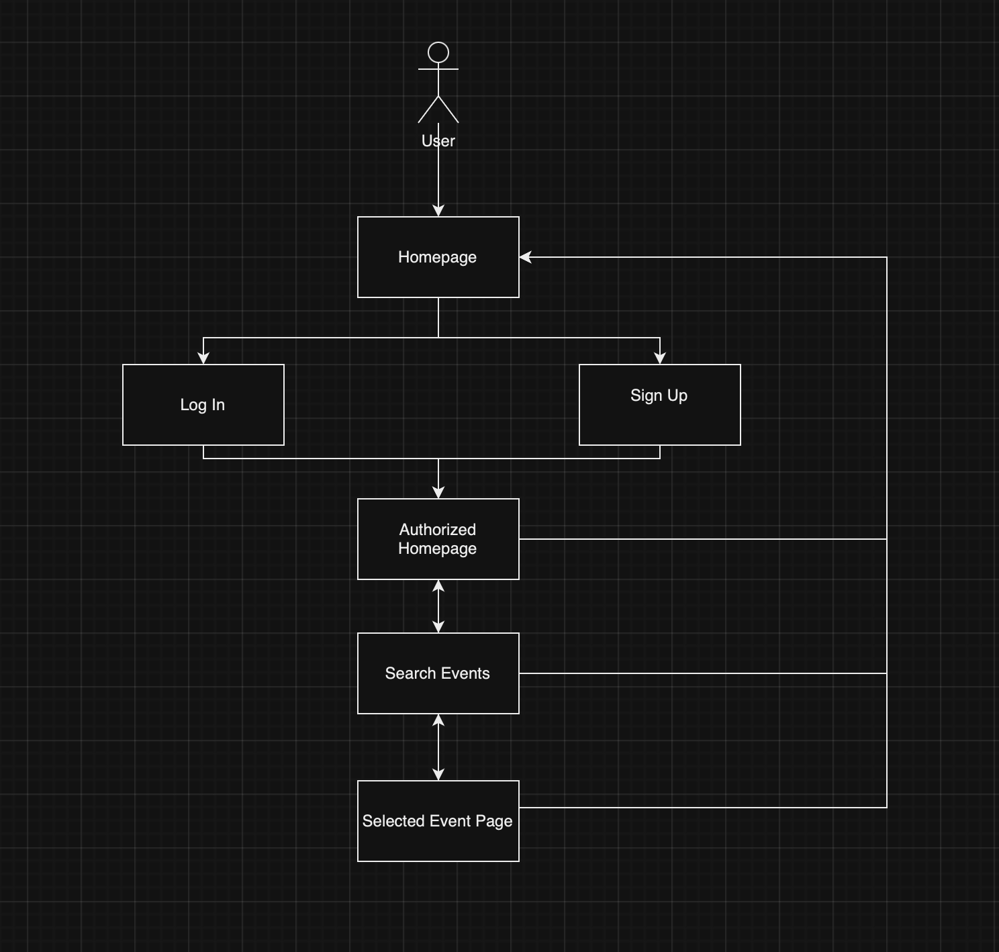

# Welcome To EventRadar

## About EventRadar
EventRadar is a Flask-based web application designed to simplify the process of discovering local and virtual events. By integrating with the Ticketmaster API, EventRadar provides users with access to a comprehensive list of events, ranging from concerts to professional seminars. The platform features secure user authentication, personalized event recommendations, and an intuitive interface that ensures a seamless user experience.

## Tech Stack
EventRadar leverages a robust and versatile set of technologies, ensuring a scalable, secure, and user-friendly platform. Below is a breakdown of the main technologies and tools used:

- **Flask**: A lightweight and flexible Python web application framework that provides the tools and technologies to build a powerful web interface. Flask serves as the backbone of the application, facilitating routing, request handling, and more.

- **SQLite**: Chosen for its simplicity and efficiency in managing smaller-scale applications, SQLite is used as the database management system. It provides a lightweight disk-based database that doesn't require a separate server process, making it ideal for development and testing environments.

- **SQLAlchemy**: This SQL toolkit and Object-Relational Mapping (ORM) system is used for handling all database interactions. SQLAlchemy abstracts common database tasks and provides a powerful data manipulation interface for Flask applications.

- **Flask-Login**: Used for managing user sessions, Flask-Login handles the common tasks of logging in, logging out, and remembering user sessions over extended periods of time.

- **SHA-256 Hashing**: Security is enhanced using SHA-256, a cryptographic hash function in the SHA-2 family, which secures passwords and sensitive data stored in the database.

- **Ticketmaster API**: Integrates with EventRadar to fetch a broad spectrum of event data, allowing users to explore a variety of local events based on their interests.

- **Bootstrap**: For front-end development, Bootstrap is employed to design responsive and mobile-first pages that enhance user experience and interface design.

## How to Run:
To get EventRadar up and running on your local machine for development and testing purposes, follow these detailed steps:
- **Create a Virtual Environment**
  Creating a virtual environment is essential to isolate your package dependencies locally:
  - ** For Windows:
  ```bash
    python -m venv venv
    venv\Scripts\activate
  ```
  - **For macOS and Linux**:
  ```bash
    python3 -m venv venv
    source venv/bin/activatex
  ```
- **Install requirements**:
  After running your virtual environment, make sure to install all the requirements using the command:
  ```bash
    pip install -r requirements.txt
  ```
  Make sure that you are in the EventRadar directory that has the `requirements.txt` file 


- **Run Server**
Finally, run the server with the command:
```bash
  python3 run.py
```

## Flowchart
This flowchart outlines the user journey within EventRadar, starting from user authentication through registration and login processes. After logging in, users land on the homepage where they can access a the search function where they can look for events near their area or a specific function. User actions such as event searches and viewing search results are depicted, as well as account creation and user login. 



